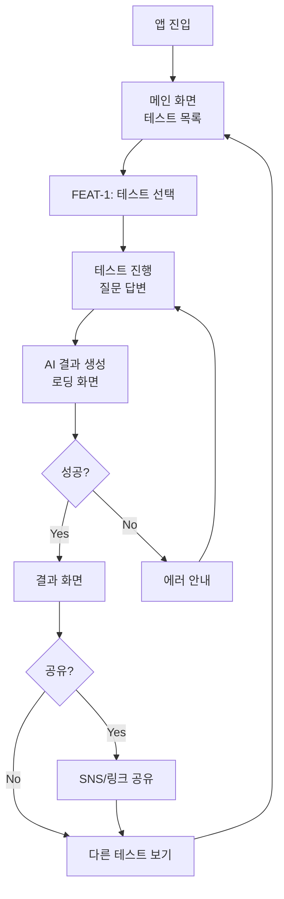
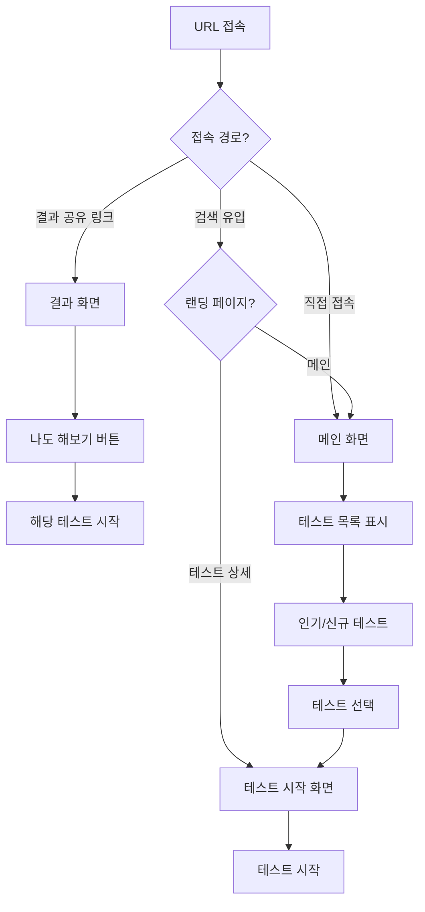
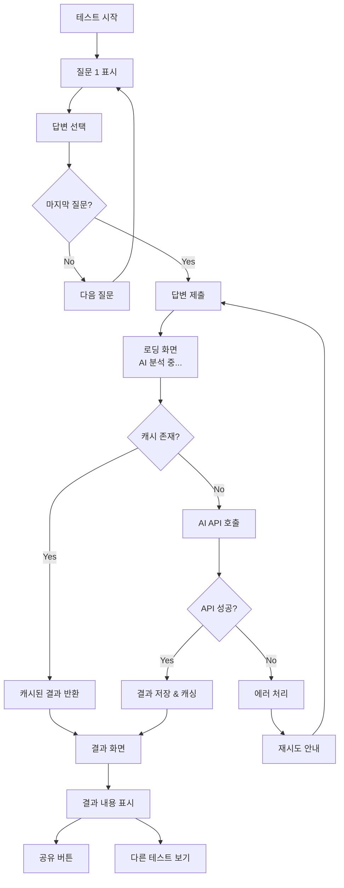
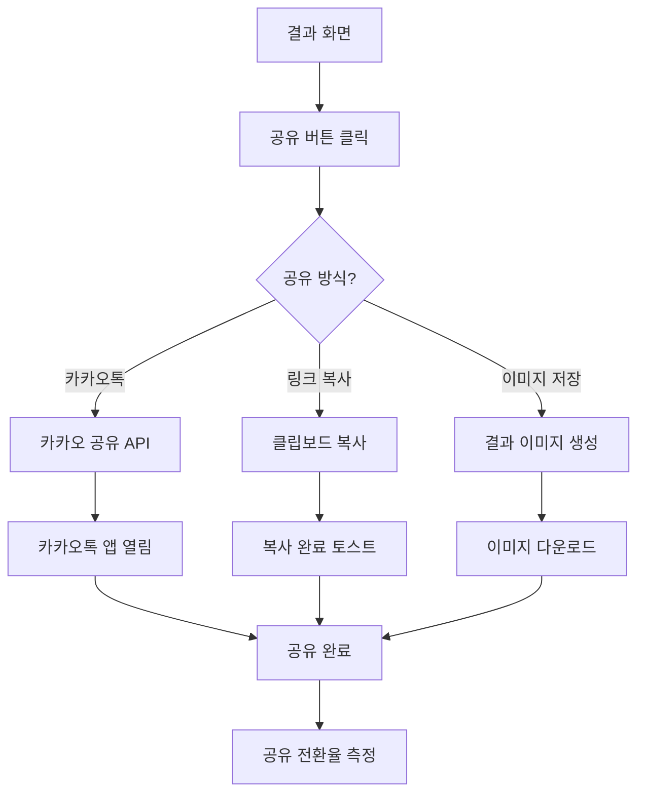
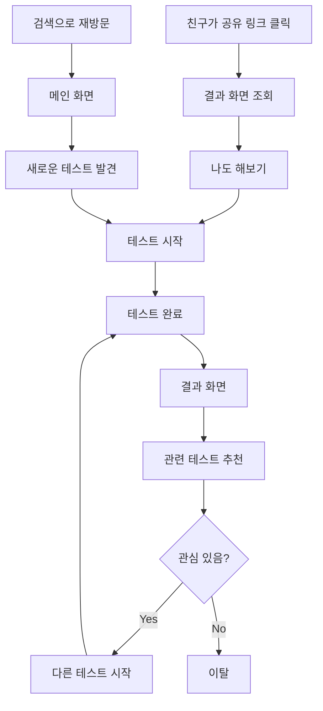
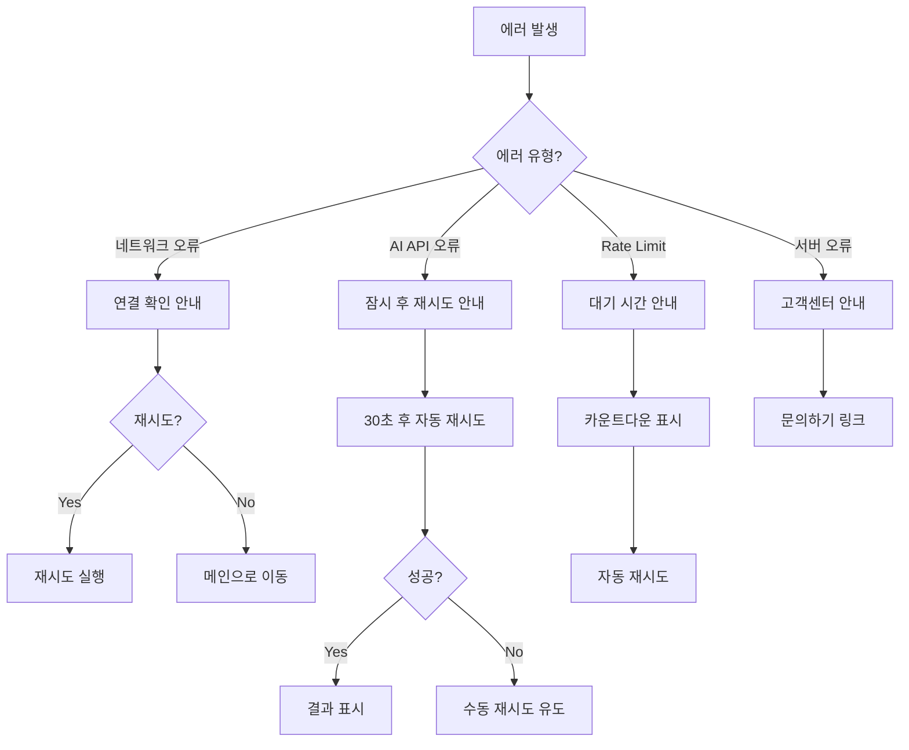
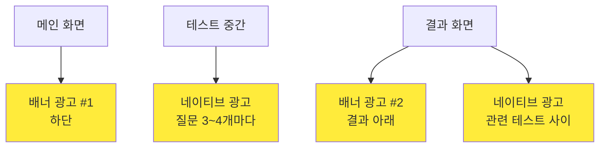

# User Flow (사용자 흐름도)

> Mermaid 플로우차트로 핵심 기능의 주요 여정을 표현합니다.
> 성공/실패 분기를 포함하고, 비로그인 기반의 간단한 흐름입니다.

---

## MVP 캡슐

| # | 항목 | 내용 |
|---|------|------|
| 1 | 목표 | AdSense 부업 수익 창출을 위한 AI 심리테스트 플랫폼 |
| 2 | 페르소나 | 10~30대 (중고등학생, 대학생, 직장인) |
| 3 | 핵심 기능 | FEAT-1: AI 심리테스트 (개인화된 결과 생성) |
| 4 | 성공 지표 (노스스타) | AdSense 월 수익 |
| 5 | 입력 지표 | 테스트 완료율, 공유 전환율 |
| 6 | 비기능 요구 | 빠른 로딩 속도 (3초 이내) |
| 7 | Out-of-scope | 프리미엄 유료화, 소셜 로그인, 회원가입 |
| 8 | Top 리스크 | AI API 비용이 수익보다 높아질 수 있음 |
| 9 | 완화/실험 | 결과 캐싱, API 호출 최적화, 비용 모니터링 |
| 10 | 다음 단계 | MVP 개발 시작 - 테스트 1개로 검증 |

---

## 1. 전체 사용자 여정 (Overview)

---

## 2. FEAT-0: 메인 화면 진입 플로우

---

## 3. FEAT-1: AI 심리테스트 플로우

---

## 4. 결과 공유 플로우

---

## 5. 리텐션 루프 (재방문 유도)

---

## 6. 에러 처리 플로우

---

## 7. 화면 목록 (Screen Inventory)

| 화면 ID | 화면명 | FEAT | 진입점 | 주요 액션 |
|---------|--------|------|--------|----------|
| S-01 | 메인 화면 | FEAT-0 | URL 접속 | 테스트 목록 조회, 테스트 선택 |
| S-02 | 테스트 시작 | FEAT-1 | S-01, 공유 링크 | 테스트 소개 확인, 시작하기 |
| S-03 | 테스트 질문 | FEAT-1 | S-02 | 질문 답변 선택 |
| S-04 | 로딩 화면 | FEAT-1 | S-03 | AI 분석 대기 |
| S-05 | 결과 화면 | FEAT-1 | S-04, 공유 링크 | 결과 확인, 공유, 다른 테스트 |
| S-06 | 에러 화면 | - | 모든 화면 | 재시도, 메인으로 |

---

## 8. 모바일 vs PC 화면 차이

### 8.1 공통 요소
- 테스트 진행 플로우 동일
- 결과 화면 레이아웃 동일
- 공유 기능 동일

### 8.2 모바일 전용
- 하단 네비게이션 바
- 스와이프 제스처 (질문 이동)
- 카카오톡 공유 버튼 우선 배치

### 8.3 PC 전용
- 사이드바 (다른 테스트 목록)
- 키보드 네비게이션 (1,2,3,4 키로 답변)
- 링크 복사 버튼 우선 배치

---

## 9. 광고 배치 포인트

### 광고 원칙
- 테스트 시작 전: 광고 최소화 (이탈 방지)
- 테스트 중: 적절한 간격으로 네이티브 광고
- 결과 후: 메인 광고 노출 (만족 상태에서 노출)
- 전체: 과하지 않게, UX 해치지 않게

---

## Decision Log

| ID | 항목 | 선택 | 근거 | 영향 |
|----|------|------|------|------|
| D-F01 | 로그인 | 비로그인 | 진입 장벽 최소화 | 개인화 제한 |
| D-F02 | 결과 저장 | URL 기반 | 공유 용이 | 90일 후 만료 |
| D-F03 | 공유 방식 | 카카오+링크+이미지 | 타겟 사용 패턴 | 개발량 증가 |
| D-F04 | 광고 위치 | 결과 화면 중심 | UX와 수익 균형 | - |
