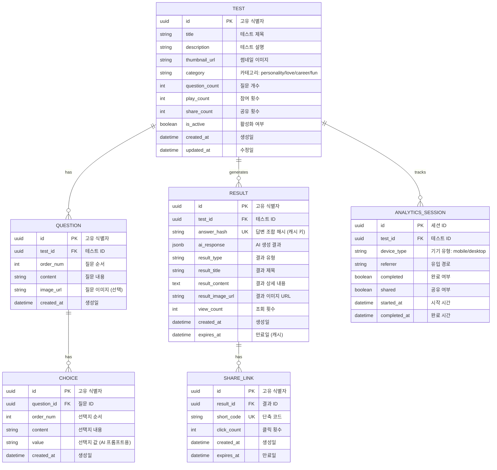
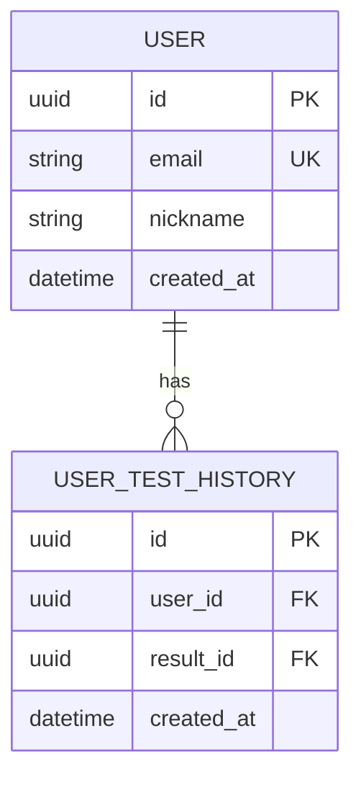

# Database Design (데이터베이스 설계)

> Mermaid ERD로 주요 엔티티와 관계를 표현합니다.
> 비로그인 서비스이므로 사용자 테이블이 없고, 테스트와 결과 중심입니다.

---

## MVP 캡슐

| # | 항목 | 내용 |
|---|------|------|
| 1 | 목표 | AdSense 부업 수익 창출을 위한 AI 심리테스트 플랫폼 |
| 2 | 페르소나 | 10~30대 (중고등학생, 대학생, 직장인) |
| 3 | 핵심 기능 | FEAT-1: AI 심리테스트 (개인화된 결과 생성) |
| 4 | 성공 지표 (노스스타) | AdSense 월 수익 |
| 5 | 입력 지표 | 테스트 완료율, 공유 전환율 |
| 6 | 비기능 요구 | 빠른 로딩 속도 (3초 이내) |
| 7 | Out-of-scope | 프리미엄 유료화, 소셜 로그인, 회원가입 |
| 8 | Top 리스크 | AI API 비용이 수익보다 높아질 수 있음 |
| 9 | 완화/실험 | 결과 캐싱, API 호출 최적화, 비용 모니터링 |
| 10 | 다음 단계 | MVP 개발 시작 - 테스트 1개로 검증 |

---

## 1. ERD (Entity Relationship Diagram)



---

## 2. 엔티티 상세 정의

### 2.1 TEST (테스트) - FEAT-1

| 컬럼 | 타입 | 제약조건 | 설명 |
|------|------|----------|------|
| id | UUID | PK, DEFAULT gen_random_uuid() | 고유 식별자 |
| title | VARCHAR(100) | NOT NULL | 테스트 제목 |
| description | VARCHAR(500) | NOT NULL | 테스트 설명 |
| thumbnail_url | VARCHAR(500) | NULL | 썸네일 이미지 URL |
| category | VARCHAR(50) | NOT NULL, DEFAULT 'fun' | 카테고리 |
| question_count | INTEGER | NOT NULL, DEFAULT 0 | 질문 개수 (캐시) |
| play_count | INTEGER | NOT NULL, DEFAULT 0 | 참여 횟수 |
| share_count | INTEGER | NOT NULL, DEFAULT 0 | 공유 횟수 |
| is_active | BOOLEAN | NOT NULL, DEFAULT true | 활성화 여부 |
| created_at | TIMESTAMP | NOT NULL, DEFAULT NOW() | 생성일 |
| updated_at | TIMESTAMP | NOT NULL, DEFAULT NOW() | 수정일 |

**인덱스:**
- `idx_test_category` ON category WHERE is_active = true
- `idx_test_play_count` ON play_count DESC WHERE is_active = true

**카테고리 값:**
- `personality`: 성격
- `love`: 연애
- `career`: 직업/진로
- `fun`: 재미/기타

### 2.2 QUESTION (질문) - FEAT-1

| 컬럼 | 타입 | 제약조건 | 설명 |
|------|------|----------|------|
| id | UUID | PK | 고유 식별자 |
| test_id | UUID | FK → TEST.id, NOT NULL | 테스트 ID |
| order_num | INTEGER | NOT NULL | 질문 순서 (1부터) |
| content | VARCHAR(500) | NOT NULL | 질문 내용 |
| image_url | VARCHAR(500) | NULL | 질문 이미지 URL |
| created_at | TIMESTAMP | NOT NULL, DEFAULT NOW() | 생성일 |

**인덱스:**
- `idx_question_test_order` ON (test_id, order_num)

**제약:**
- UNIQUE (test_id, order_num)

### 2.3 CHOICE (선택지) - FEAT-1

| 컬럼 | 타입 | 제약조건 | 설명 |
|------|------|----------|------|
| id | UUID | PK | 고유 식별자 |
| question_id | UUID | FK → QUESTION.id, NOT NULL | 질문 ID |
| order_num | INTEGER | NOT NULL | 선택지 순서 (1부터) |
| content | VARCHAR(200) | NOT NULL | 선택지 내용 |
| value | VARCHAR(50) | NOT NULL | AI 프롬프트용 값 |
| created_at | TIMESTAMP | NOT NULL, DEFAULT NOW() | 생성일 |

**인덱스:**
- `idx_choice_question_order` ON (question_id, order_num)

### 2.4 RESULT (결과 캐시) - FEAT-1

| 컬럼 | 타입 | 제약조건 | 설명 |
|------|------|----------|------|
| id | UUID | PK | 고유 식별자 |
| test_id | UUID | FK → TEST.id, NOT NULL | 테스트 ID |
| answer_hash | VARCHAR(64) | UNIQUE, NOT NULL | 답변 조합 해시 |
| ai_response | JSONB | NOT NULL | AI 원본 응답 |
| result_type | VARCHAR(50) | NOT NULL | 결과 유형 코드 |
| result_title | VARCHAR(100) | NOT NULL | 결과 제목 |
| result_content | TEXT | NOT NULL | 결과 상세 내용 |
| result_image_url | VARCHAR(500) | NULL | 결과 이미지 URL |
| view_count | INTEGER | NOT NULL, DEFAULT 0 | 조회 횟수 |
| created_at | TIMESTAMP | NOT NULL, DEFAULT NOW() | 생성일 |
| expires_at | TIMESTAMP | NOT NULL | 만료일 |

**인덱스:**
- `idx_result_test_hash` ON (test_id, answer_hash)
- `idx_result_expires` ON expires_at

**캐싱 전략:**
- `answer_hash` = SHA256(test_id + 정렬된 답변 배열)
- 동일한 답변 조합은 캐시된 결과 반환
- `expires_at` = created_at + 30일

### 2.5 SHARE_LINK (공유 링크) - FEAT-1

| 컬럼 | 타입 | 제약조건 | 설명 |
|------|------|----------|------|
| id | UUID | PK | 고유 식별자 |
| result_id | UUID | FK → RESULT.id, NOT NULL | 결과 ID |
| short_code | VARCHAR(10) | UNIQUE, NOT NULL | 단축 코드 |
| click_count | INTEGER | NOT NULL, DEFAULT 0 | 클릭 횟수 |
| created_at | TIMESTAMP | NOT NULL, DEFAULT NOW() | 생성일 |
| expires_at | TIMESTAMP | NOT NULL | 만료일 |

**인덱스:**
- `idx_share_short_code` ON short_code

**단축 코드 규칙:**
- 8자리 영숫자 (Base62)
- 예: `a1B2c3D4`
- URL: `https://simly.com/s/a1B2c3D4`

### 2.6 ANALYTICS_SESSION (분석 세션) - 분석용

| 컬럼 | 타입 | 제약조건 | 설명 |
|------|------|----------|------|
| id | UUID | PK | 세션 ID |
| test_id | UUID | FK → TEST.id, NOT NULL | 테스트 ID |
| device_type | VARCHAR(20) | NOT NULL | 기기 유형 |
| referrer | VARCHAR(500) | NULL | 유입 경로 |
| completed | BOOLEAN | NOT NULL, DEFAULT false | 완료 여부 |
| shared | BOOLEAN | NOT NULL, DEFAULT false | 공유 여부 |
| started_at | TIMESTAMP | NOT NULL, DEFAULT NOW() | 시작 시간 |
| completed_at | TIMESTAMP | NULL | 완료 시간 |

**인덱스:**
- `idx_analytics_test_date` ON (test_id, started_at)
- `idx_analytics_completed` ON completed WHERE completed = true

---

## 3. 관계 정의

| 부모 | 자식 | 관계 | 설명 |
|------|------|------|------|
| TEST | QUESTION | 1:N | 테스트는 여러 질문 포함 |
| QUESTION | CHOICE | 1:N | 질문은 여러 선택지 포함 |
| TEST | RESULT | 1:N | 테스트는 여러 결과 생성 |
| RESULT | SHARE_LINK | 1:N | 결과는 여러 공유 링크 가능 |
| TEST | ANALYTICS_SESSION | 1:N | 테스트는 여러 세션 추적 |

---

## 4. 데이터 생명주기

| 엔티티 | 생성 시점 | 보존 기간 | 삭제/익명화 |
|--------|----------|----------|------------|
| TEST | 관리자 등록 | 영구 | Soft delete |
| QUESTION | 테스트와 함께 | 테스트와 동일 | Cascade |
| CHOICE | 질문과 함께 | 질문과 동일 | Cascade |
| RESULT | 테스트 완료 | 30일 | 자동 삭제 |
| SHARE_LINK | 공유 시 | 90일 | 자동 삭제 |
| ANALYTICS_SESSION | 테스트 시작 | 90일 | 익명화 후 집계 |

---

## 5. Redis 캐시 구조

### 5.1 캐시 키 설계

| 키 패턴 | 용도 | TTL |
|---------|------|-----|
| `test:list:active` | 활성 테스트 목록 | 5분 |
| `test:{id}:detail` | 테스트 상세 (질문 포함) | 10분 |
| `test:{id}:popular` | 인기 테스트 여부 | 1시간 |
| `result:{test_id}:{answer_hash}` | AI 결과 캐시 | 30일 |
| `share:{short_code}` | 공유 링크 결과 ID | 90일 |
| `rate_limit:{ip}` | IP별 요청 제한 | 1분 |

### 5.2 캐시 예시

```redis
# 테스트 목록
SET test:list:active '[{"id":"...", "title":"..."}]' EX 300

# AI 결과 캐시
SET result:abc123:sha256hash '{"title":"...", "content":"..."}' EX 2592000

# 공유 링크
SET share:a1B2c3D4 'result-uuid' EX 7776000
```

---

## 6. 확장 고려사항

### 6.1 v2에서 추가 예정 엔티티



### 6.2 인덱스 전략

- **읽기 최적화**: 테스트 목록 조회가 가장 빈번
- **카운터 업데이트**: play_count, share_count는 Redis에서 집계 후 배치 업데이트
- **만료 데이터 정리**: 일일 배치로 expires_at 지난 데이터 삭제

---

## 7. 데이터 예시

### 7.1 테스트 데이터

```json
{
  "id": "550e8400-e29b-41d4-a716-446655440000",
  "title": "나의 연애 유형은?",
  "description": "AI가 분석하는 당신의 숨겨진 연애 스타일",
  "thumbnail_url": "https://cdn.simly.com/tests/love-type.jpg",
  "category": "love",
  "question_count": 10,
  "play_count": 1523,
  "share_count": 342
}
```

### 7.2 AI 결과 데이터

```json
{
  "id": "660e8400-e29b-41d4-a716-446655440001",
  "test_id": "550e8400-e29b-41d4-a716-446655440000",
  "answer_hash": "a1b2c3d4e5f6...",
  "result_type": "romantic_dreamer",
  "result_title": "로맨틱 드리머",
  "result_content": "당신은 사랑에 빠지면 온 세상이 장밋빛으로 변하는 타입이에요...",
  "ai_response": {
    "model": "gpt-4o-mini",
    "prompt_tokens": 150,
    "completion_tokens": 300,
    "raw_response": "..."
  }
}
```

---

## Decision Log

| ID | 항목 | 선택 | 근거 | 영향 |
|----|------|------|------|------|
| D-D01 | 사용자 테이블 | 없음 | 비로그인 서비스 | 개인화 제한 |
| D-D02 | 결과 캐싱 | answer_hash 기반 | API 비용 절감 | 중복 답변만 캐시 |
| D-D03 | 캐시 TTL | 30일 | 비용과 신선도 균형 | 오래된 결과 가능 |
| D-D04 | 분석 데이터 | 익명 세션 | 개인정보 미수집 | 상세 분석 제한 |
