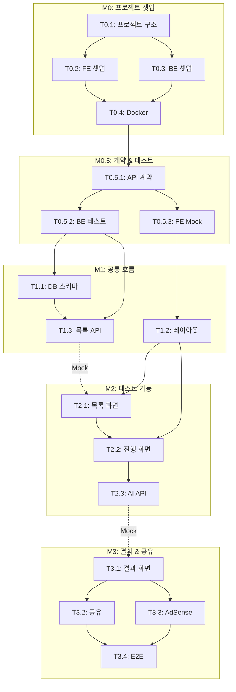

# TASKS: Simly - AI 심리테스트 플랫폼

> AI 개발 파트너(오케스트레이터 + 서브에이전트)용 태스크 목록
> TDD 워크플로우 + Git Worktree 기반 병렬 개발

---

## MVP 캡슐

| # | 항목 | 내용 |
|---|------|------|
| 1 | 목표 | AdSense 부업 수익 창출을 위한 AI 심리테스트 플랫폼 |
| 2 | 페르소나 | 10~30대 (중고등학생, 대학생, 직장인) |
| 3 | 핵심 기능 | FEAT-1: AI 심리테스트 (개인화된 결과 생성) |
| 4 | 성공 지표 (노스스타) | AdSense 월 수익 |
| 5 | 입력 지표 | 테스트 완료율, 공유 전환율 |
| 6 | 비기능 요구 | 빠른 로딩 속도 (3초 이내) |
| 7 | Out-of-scope | 프리미엄 유료화, 소셜 로그인, 회원가입 |
| 8 | Top 리스크 | AI API 비용이 수익보다 높아질 수 있음 |
| 9 | 완화/실험 | 결과 캐싱, API 호출 최적화, 비용 모니터링 |
| 10 | 다음 단계 | MVP 개발 시작 |

---

## 기술 스택 요약

| 영역 | 선택 |
|------|------|
| 백엔드 | FastAPI + Python 3.11+ |
| 프론트엔드 | Next.js 14 + TypeScript + TailwindCSS |
| 데이터베이스 | PostgreSQL + Redis |
| AI | OpenAI API (GPT-4o-mini) |
| 배포 | Vercel (FE) + Railway (BE) |

---

## 마일스톤 개요

| 마일스톤 | Phase | 설명 | 주요 산출물 |
|----------|-------|------|------------|
| M0 | 0 | 프로젝트 셋업 | 폴더 구조, Docker, 환경 설정 |
| M0.5 | 0 | 계약 & 테스트 설계 | API 계약, Mock, 테스트 스켈레톤 |
| M1 | 1 | FEAT-0 공통 흐름 | 메인 화면, 레이아웃, 라우팅 |
| M2 | 2 | FEAT-1 테스트 기능 | 테스트 목록, 질문, AI 결과 |
| M3 | 3 | FEAT-1 결과 & 공유 | 결과 화면, 공유 기능, AdSense |

---

## M0: 프로젝트 셋업

> Phase 0 - main 브랜치에서 작업 (Git Worktree 불필요)

### [] Phase 0, T0.1: 프로젝트 구조 초기화

**담당**: frontend-specialist

**작업 내용**:
- 모노레포 구조 생성 (frontend/, backend/, contracts/, docs/)
- Git 초기화 및 .gitignore 설정
- README.md 작성

**산출물**:
- `frontend/` - Next.js 프로젝트
- `backend/` - FastAPI 프로젝트
- `contracts/` - API 계약 파일
- `.gitignore`
- `README.md`

**완료 조건**:
- [ ] 폴더 구조 생성됨
- [ ] Git 저장소 초기화됨

---

### [] Phase 0, T0.2: 프론트엔드 셋업

**담당**: frontend-specialist

**작업 내용**:
- Next.js 14 (App Router) 프로젝트 생성
- TypeScript 설정
- TailwindCSS 설정
- ESLint + Prettier 설정
- Vitest + React Testing Library 설정

**산출물**:
```
frontend/
├── src/
│   ├── app/
│   │   ├── layout.tsx
│   │   └── page.tsx
│   ├── components/
│   │   └── ui/
│   ├── lib/
│   ├── hooks/
│   └── types/
├── tailwind.config.ts
├── tsconfig.json
├── vitest.config.ts
└── package.json
```

**완료 조건**:
- [ ] `npm run dev` 실행 시 로컬 서버 구동
- [ ] `npm run test` 실행 가능
- [ ] `npm run lint` 통과

---

### [] Phase 0, T0.3: 백엔드 셋업

**담당**: backend-specialist

**작업 내용**:
- FastAPI 프로젝트 구조 생성
- SQLAlchemy 2.0 + Alembic 설정
- Pydantic v2 설정
- pytest 설정
- Ruff + Black 설정

**산출물**:
```
backend/
├── app/
│   ├── __init__.py
│   ├── main.py
│   ├── core/
│   │   ├── config.py
│   │   └── database.py
│   ├── api/
│   │   └── v1/
│   ├── models/
│   ├── schemas/
│   └── services/
├── tests/
├── alembic/
├── alembic.ini
├── pyproject.toml
└── requirements.txt
```

**완료 조건**:
- [ ] `uvicorn app.main:app --reload` 실행 가능
- [ ] `pytest` 실행 가능
- [ ] `/docs` 에서 Swagger UI 확인

---

### [] Phase 0, T0.4: Docker 환경 설정

**담당**: backend-specialist

**작업 내용**:
- docker-compose.yml (개발용)
- PostgreSQL, Redis 컨테이너 설정
- 환경 변수 템플릿 (.env.example)

**산출물**:
- `docker-compose.yml`
- `docker-compose.dev.yml`
- `.env.example`

**완료 조건**:
- [ ] `docker-compose up -d` 실행 시 DB, Redis 구동
- [ ] 백엔드에서 DB 연결 확인

---

## M0.5: 계약 & 테스트 설계

> Phase 0 - API 계약 정의 + 테스트 스켈레톤 (TDD의 계약 단계)

### [] Phase 0, T0.5.1: API 계약 정의

**담당**: backend-specialist

**작업 내용**:
- TypeScript 타입으로 API 계약 정의
- Pydantic 스키마와 동기화
- API 엔드포인트 명세

**산출물**:
```
contracts/
├── types.ts              # 공통 타입
├── test.contract.ts      # 테스트 API 계약
└── result.contract.ts    # 결과 API 계약
```

**API 엔드포인트 계약**:
```typescript
// GET /api/v1/tests
interface TestListResponse {
  data: TestSummary[];
}

// GET /api/v1/tests/:id
interface TestDetailResponse {
  data: Test;
}

// POST /api/v1/tests/:id/submit
interface SubmitRequest {
  answers: Answer[];
}
interface SubmitResponse {
  data: Result;
}

// GET /api/v1/results/:id
interface ResultResponse {
  data: Result;
}
```

**완료 조건**:
- [ ] 모든 API 엔드포인트 타입 정의됨
- [ ] BE 스키마와 FE 타입 일치

---

### [] Phase 0, T0.5.2: 백엔드 테스트 스켈레톤

**담당**: backend-specialist

**작업 내용**:
- pytest fixture 설정 (DB, 클라이언트)
- Factory Boy 테스트 데이터 팩토리
- 실패하는 테스트 스켈레톤 작성 (RED 상태)

**산출물**:
```
backend/tests/
├── conftest.py           # fixtures
├── factories.py          # Factory Boy
├── api/
│   ├── test_tests.py     # 테스트 API 테스트
│   └── test_results.py   # 결과 API 테스트
└── services/
    └── test_ai_service.py
```

**테스트 스켈레톤 예시**:
```python
# tests/api/test_tests.py
async def test_get_tests_returns_list(client):
    """테스트 목록 조회 - 성공"""
    response = await client.get("/api/v1/tests")
    assert response.status_code == 200
    assert "data" in response.json()

async def test_get_test_detail(client, test_fixture):
    """테스트 상세 조회 - 성공"""
    response = await client.get(f"/api/v1/tests/{test_fixture.id}")
    assert response.status_code == 200

async def test_submit_test_generates_ai_result(client, test_fixture):
    """테스트 제출 - AI 결과 생성"""
    response = await client.post(
        f"/api/v1/tests/{test_fixture.id}/submit",
        json={"answers": [{"question_id": "...", "choice_id": "..."}]}
    )
    assert response.status_code == 200
    assert "result_title" in response.json()["data"]
```

**완료 조건**:
- [ ] `pytest` 실행 시 테스트가 실패함 (RED 상태 = 정상)
- [ ] 모든 API 엔드포인트에 대한 테스트 존재

---

### [] Phase 0, T0.5.3: 프론트엔드 테스트 + MSW Mock

**담당**: frontend-specialist

**작업 내용**:
- MSW (Mock Service Worker) 설정
- API 계약 기반 Mock 핸들러 작성
- 컴포넌트 테스트 스켈레톤 작성

**산출물**:
```
frontend/src/
├── mocks/
│   ├── browser.ts        # MSW 브라우저 설정
│   ├── server.ts         # MSW 서버 설정 (테스트용)
│   ├── handlers/
│   │   ├── tests.ts      # 테스트 API Mock
│   │   └── results.ts    # 결과 API Mock
│   └── data/
│       └── mockTests.ts  # Mock 데이터
├── __tests__/
│   ├── setup.ts
│   └── components/
│       ├── TestCard.test.tsx
│       └── TestQuestion.test.tsx
```

**완료 조건**:
- [ ] MSW 설정 완료
- [ ] Mock 핸들러가 계약과 일치
- [ ] `npm run test` 실행 가능 (실패 OK)

---

## M1: FEAT-0 공통 흐름

> Phase 1 - Git Worktree 필수

### [] Phase 1, T1.1: 데이터베이스 스키마 & 시드 데이터 RED→GREEN

**담당**: database-specialist

**Git Worktree 설정**:
```bash
# 1. Worktree 생성
git worktree add ../simly-phase1-db -b phase/1-database
cd ../simly-phase1-db

# 2. 작업 완료 후 병합 (사용자 승인 필요)
# git checkout main
# git merge phase/1-database
# git worktree remove ../simly-phase1-db
```

**TDD 사이클**:

1. **RED**: 테스트 작성 (실패 확인)
   ```bash
   # 테스트 파일: backend/tests/models/test_models.py
   pytest backend/tests/models/test_models.py -v  # Expected: FAILED
   ```

2. **GREEN**: 최소 구현 (테스트 통과)
   ```bash
   # 구현 파일: backend/app/models/
   alembic upgrade head
   pytest backend/tests/models/test_models.py -v  # Expected: PASSED
   ```

3. **REFACTOR**: 리팩토링

**산출물**:
- `backend/app/models/test.py` - Test, Question, Choice 모델
- `backend/app/models/result.py` - Result, ShareLink 모델
- `backend/alembic/versions/` - 마이그레이션 파일
- `backend/scripts/seed.py` - 시드 데이터 (테스트 1개)

**인수 조건**:
- [ ] 테스트 먼저 작성됨 (RED 확인)
- [ ] 모든 모델 테스트 통과 (GREEN)
- [ ] 마이그레이션 실행 성공
- [ ] 시드 데이터로 테스트 1개 생성됨

---

### [] Phase 1, T1.2: 메인 레이아웃 & 라우팅 RED→GREEN

**담당**: frontend-specialist

**Git Worktree 설정**:
```bash
git worktree add ../simly-phase1-layout -b phase/1-layout
cd ../simly-phase1-layout
```

**TDD 사이클**:

1. **RED**: 테스트 작성
   ```bash
   # 테스트 파일: frontend/src/__tests__/components/Layout.test.tsx
   npm run test -- src/__tests__/components/Layout.test.tsx  # FAILED
   ```

2. **GREEN**: 구현
   ```bash
   # 구현 파일: frontend/src/components/Layout.tsx
   npm run test -- src/__tests__/components/Layout.test.tsx  # PASSED
   ```

**산출물**:
```
frontend/src/
├── app/
│   ├── layout.tsx        # 루트 레이아웃
│   ├── page.tsx          # 메인 페이지
│   └── globals.css       # 글로벌 스타일
├── components/
│   ├── Layout/
│   │   ├── Header.tsx
│   │   └── Footer.tsx
│   └── ui/
│       ├── Button.tsx
│       └── Card.tsx
```

**인수 조건**:
- [ ] 모바일/PC 레이아웃 분기
- [ ] 테스트 통과
- [ ] TailwindCSS 디자인 시스템 적용

---

### [] Phase 1, T1.3: 테스트 목록 API RED→GREEN

**담당**: backend-specialist

**Git Worktree 설정**:
```bash
git worktree add ../simly-phase1-api -b phase/1-tests-api
cd ../simly-phase1-api
```

**TDD 사이클**:

1. **RED**: 테스트 작성
   ```bash
   pytest backend/tests/api/test_tests.py::test_get_tests_returns_list -v
   ```

2. **GREEN**: 구현
   ```bash
   # backend/app/api/v1/tests.py
   pytest backend/tests/api/test_tests.py -v  # PASSED
   ```

**산출물**:
- `backend/app/api/v1/tests.py` - 테스트 API 라우터
- `backend/app/schemas/test.py` - 요청/응답 스키마
- `backend/app/services/test_service.py` - 비즈니스 로직

**API 엔드포인트**:
| 메서드 | 경로 | 설명 |
|--------|------|------|
| GET | /api/v1/tests | 테스트 목록 |
| GET | /api/v1/tests/:id | 테스트 상세 (질문 포함) |

**인수 조건**:
- [ ] 테스트 먼저 작성 (RED)
- [ ] 모든 API 테스트 통과 (GREEN)
- [ ] Swagger 문서 자동 생성

---

## M2: FEAT-1 테스트 기능

> Phase 2 - Git Worktree 필수

### [] Phase 2, T2.1: 테스트 목록 화면 RED→GREEN

**담당**: frontend-specialist

**의존성**: T1.3 (테스트 목록 API) - **MSW Mock으로 독립 개발 가능**

**Git Worktree 설정**:
```bash
git worktree add ../simly-phase2-test-list -b phase/2-test-list
cd ../simly-phase2-test-list
```

**TDD 사이클**:

1. **RED**:
   ```bash
   npm run test -- src/__tests__/pages/TestList.test.tsx
   ```

2. **GREEN**:
   ```bash
   # frontend/src/app/page.tsx (또는 tests/page.tsx)
   npm run test -- src/__tests__/pages/TestList.test.tsx  # PASSED
   ```

**산출물**:
- `frontend/src/app/page.tsx` - 메인 페이지 (테스트 목록)
- `frontend/src/components/test/TestCard.tsx` - 테스트 카드
- `frontend/src/components/test/TestList.tsx` - 테스트 리스트

**인수 조건**:
- [ ] 테스트 목록 표시
- [ ] 테스트 카드 클릭 시 상세 페이지 이동
- [ ] 로딩 상태 표시
- [ ] 에러 상태 표시

---

### [] Phase 2, T2.2: 테스트 진행 화면 RED→GREEN

**담당**: frontend-specialist

**Git Worktree 설정**:
```bash
git worktree add ../simly-phase2-test-play -b phase/2-test-play
cd ../simly-phase2-test-play
```

**TDD 사이클**:

1. **RED**:
   ```bash
   npm run test -- src/__tests__/pages/TestPlay.test.tsx
   ```

2. **GREEN**:
   ```bash
   npm run test -- src/__tests__/pages/TestPlay.test.tsx  # PASSED
   ```

**산출물**:
- `frontend/src/app/tests/[id]/page.tsx` - 테스트 상세/시작
- `frontend/src/app/tests/[id]/play/page.tsx` - 테스트 진행
- `frontend/src/components/test/TestQuestion.tsx` - 질문 컴포넌트
- `frontend/src/components/test/TestChoice.tsx` - 선택지 컴포넌트
- `frontend/src/components/test/TestProgress.tsx` - 진행바
- `frontend/src/hooks/useTestProgress.ts` - 진행 상태 훅
- `frontend/src/stores/testStore.ts` - 테스트 상태 (Zustand)

**인수 조건**:
- [ ] 질문 순차 표시
- [ ] 선택지 선택 시 다음 질문
- [ ] 진행바 업데이트
- [ ] 마지막 질문 완료 시 제출

---

### [] Phase 2, T2.3: AI 결과 생성 API RED→GREEN

**담당**: backend-specialist

**Git Worktree 설정**:
```bash
git worktree add ../simly-phase2-ai-api -b phase/2-ai-api
cd ../simly-phase2-ai-api
```

**TDD 사이클**:

1. **RED**:
   ```bash
   pytest backend/tests/api/test_tests.py::test_submit_test_generates_ai_result -v
   pytest backend/tests/services/test_ai_service.py -v
   ```

2. **GREEN**:
   ```bash
   pytest backend/tests/api/test_tests.py -v
   pytest backend/tests/services/test_ai_service.py -v  # PASSED
   ```

**산출물**:
- `backend/app/api/v1/tests.py` - submit 엔드포인트 추가
- `backend/app/services/ai_service.py` - OpenAI API 연동
- `backend/app/services/result_service.py` - 결과 저장/캐싱

**API 엔드포인트**:
| 메서드 | 경로 | 설명 |
|--------|------|------|
| POST | /api/v1/tests/:id/submit | 테스트 제출, AI 결과 생성 |

**캐싱 로직**:
```python
# 답변 해시로 캐시 확인
answer_hash = hash_answers(test_id, answers)
cached = await redis.get(f"result:{test_id}:{answer_hash}")
if cached:
    return cached

# AI 생성
result = await ai_service.generate_result(test, answers)
await redis.setex(f"result:{test_id}:{answer_hash}", 30*24*3600, result)
```

**인수 조건**:
- [ ] 테스트 먼저 작성 (RED)
- [ ] OpenAI API Mock으로 테스트
- [ ] 결과 캐싱 동작
- [ ] Rate limiting 적용

---

## M3: FEAT-1 결과 & 공유

> Phase 3 - Git Worktree 필수

### [] Phase 3, T3.1: 결과 화면 RED→GREEN

**담당**: frontend-specialist

**의존성**: T2.3 (AI API) - **MSW Mock으로 독립 개발 가능**

**Git Worktree 설정**:
```bash
git worktree add ../simly-phase3-result -b phase/3-result
cd ../simly-phase3-result
```

**TDD 사이클**:

1. **RED**:
   ```bash
   npm run test -- src/__tests__/pages/Result.test.tsx
   ```

2. **GREEN**:
   ```bash
   npm run test -- src/__tests__/pages/Result.test.tsx  # PASSED
   ```

**산출물**:
- `frontend/src/app/results/[id]/page.tsx` - 결과 페이지
- `frontend/src/components/result/ResultCard.tsx` - 결과 카드
- `frontend/src/components/result/ResultContent.tsx` - 결과 내용

**인수 조건**:
- [ ] AI 결과 표시 (제목, 내용)
- [ ] 결과 이미지/카드 표시
- [ ] 로딩 상태 (AI 분석 중...)
- [ ] 다른 테스트 추천

---

### [] Phase 3, T3.2: 공유 기능 RED→GREEN

**담당**: frontend-specialist + backend-specialist

**Git Worktree 설정**:
```bash
git worktree add ../simly-phase3-share -b phase/3-share
cd ../simly-phase3-share
```

**TDD 사이클 (FE)**:
```bash
npm run test -- src/__tests__/components/ShareButton.test.tsx
```

**TDD 사이클 (BE)**:
```bash
pytest backend/tests/api/test_results.py -v
```

**산출물**:
- `frontend/src/components/result/ShareButton.tsx` - 공유 버튼
- `frontend/src/lib/share.ts` - 공유 유틸 (카카오, 링크복사)
- `backend/app/api/v1/results.py` - 결과 조회 API
- `backend/app/services/share_service.py` - 단축 링크 생성

**API 엔드포인트**:
| 메서드 | 경로 | 설명 |
|--------|------|------|
| GET | /api/v1/results/:id | 결과 조회 (공유 링크용) |
| POST | /api/v1/results/:id/share | 단축 링크 생성 |

**인수 조건**:
- [ ] 링크 복사 기능
- [ ] 카카오톡 공유 기능
- [ ] 공유 링크로 결과 조회 가능
- [ ] 조회수 카운트

---

### [] Phase 3, T3.3: AdSense 연동

**담당**: frontend-specialist

**Git Worktree 설정**:
```bash
git worktree add ../simly-phase3-ads -b phase/3-ads
cd ../simly-phase3-ads
```

**작업 내용**:
- AdSense 스크립트 추가
- 광고 컴포넌트 생성
- 광고 위치 배치 (결과 화면 하단)

**산출물**:
- `frontend/src/components/ads/AdBanner.tsx` - 배너 광고
- `frontend/src/components/ads/AdNative.tsx` - 네이티브 광고

**인수 조건**:
- [ ] AdSense 스크립트 로드
- [ ] 테스트 광고 표시 확인
- [ ] 광고 위치 가이드라인 준수

---

### [] Phase 3, T3.4: E2E 테스트 & 최종 검증

**담당**: test-specialist

**Git Worktree 설정**:
```bash
git worktree add ../simly-phase3-e2e -b phase/3-e2e
cd ../simly-phase3-e2e
```

**작업 내용**:
- Playwright E2E 테스트 작성
- 주요 사용자 시나리오 테스트

**산출물**:
- `frontend/e2e/test-flow.spec.ts` - 테스트 진행 플로우
- `frontend/e2e/share-flow.spec.ts` - 공유 플로우

**E2E 시나리오**:
```typescript
test('사용자가 테스트를 완료하고 결과를 공유한다', async ({ page }) => {
  // 1. 메인 페이지 접속
  await page.goto('/');

  // 2. 테스트 선택
  await page.click('[data-testid="test-card"]');

  // 3. 테스트 시작
  await page.click('[data-testid="start-button"]');

  // 4. 질문 답변 (10회 반복)
  for (let i = 0; i < 10; i++) {
    await page.click('[data-testid="choice-1"]');
  }

  // 5. 결과 확인
  await expect(page.locator('[data-testid="result-title"]')).toBeVisible();

  // 6. 공유
  await page.click('[data-testid="share-button"]');
});
```

**인수 조건**:
- [ ] 모든 E2E 테스트 통과
- [ ] 테스트 완료율 측정 가능
- [ ] 공유 전환율 측정 가능

---

## 의존성 그래프



---

## 병렬 실행 가능 태스크

| Phase | 병렬 가능 태스크 | 조건 |
|-------|-----------------|------|
| Phase 0 | T0.2, T0.3 | T0.1 완료 후 |
| Phase 0 | T0.5.2, T0.5.3 | T0.5.1 완료 후 |
| Phase 1 | T1.1, T1.2 | Mock 사용 |
| Phase 2 | T2.1, T2.3 | Mock 사용 |
| Phase 3 | T3.2, T3.3 | T3.1 완료 후 |

---

## 예상 태스크 순서 (권장)

```
1. T0.1 → T0.2 + T0.3 (병렬) → T0.4
2. T0.5.1 → T0.5.2 + T0.5.3 (병렬)
3. T1.1 + T1.2 (병렬) → T1.3
4. T2.1 + T2.3 (병렬) → T2.2
5. T3.1 → T3.2 + T3.3 (병렬) → T3.4
```

---

## 체크리스트

- [x] 모든 태스크 ID에 Phase 접두사 포함
- [x] Phase 1+ 태스크에 Git Worktree 설정
- [x] Phase 1+ 태스크에 TDD 사이클 포함
- [x] 의존성 있는 태스크에 Mock 설정
- [x] 병렬 실행 가능 태스크 테이블
- [x] 의존성 그래프 (Mermaid)
